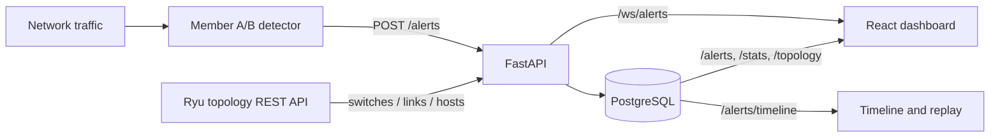
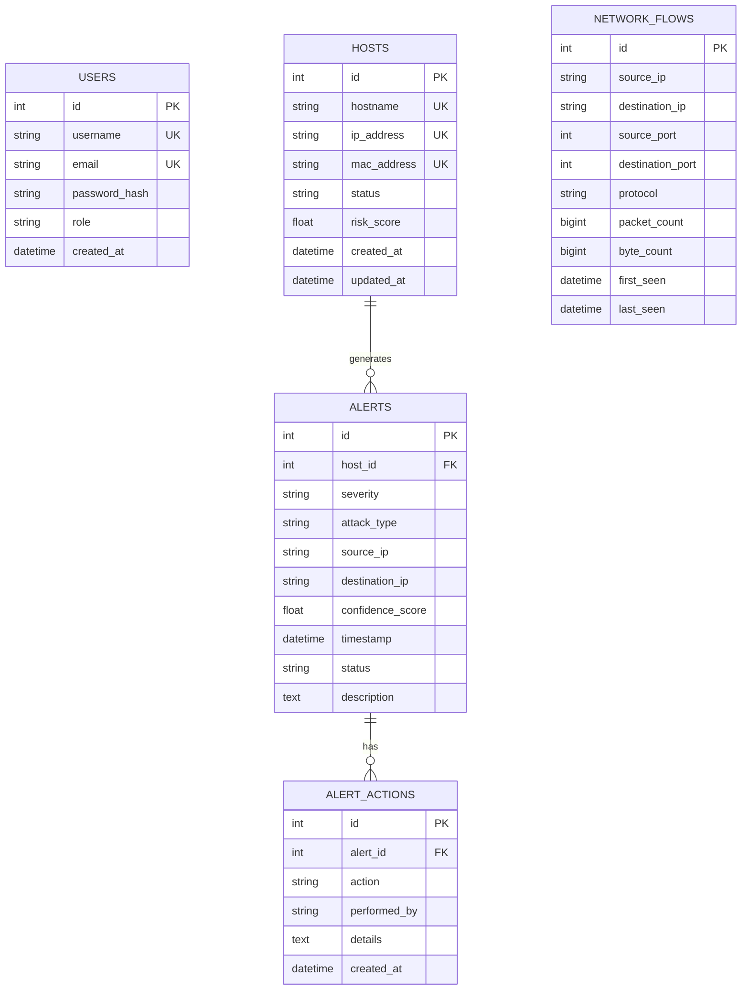

# W1–W9 implementation and Review 2 integration contract

This document records the backend/dashboard contract and the current boundary between code in this repository and the separately owned AI and SDN modules.

## Architecture



The application persists alerts before broadcasting them. The dashboard loads persisted recent alerts when it opens and then adds WebSocket events, so reconnecting does not leave the panel empty. `/alerts` is the detector ingestion contract; a call to it is the integration boundary available to the external detection module.

## Database schema

Solid-line entities are currently implemented by SQLAlchemy models and Alembic migrations. `network_flows` is the W1 schema draft for the traffic-capture module; it is not stored by this repository yet.



## REST and WebSocket contract

| Method | Path | Purpose |
| --- | --- | --- |
| POST | `/auth/register` | Create a viewer account |
| POST | `/auth/login` | Issue a JWT bearer token |
| GET | `/auth/me` | Read the current user |
| GET/POST | `/hosts` | List or register hosts |
| GET/PATCH/DELETE | `/hosts/{host_id}` | Read or manage a host |
| GET/POST | `/alerts` | List persisted alerts or ingest a detector alert |
| GET | `/alerts/recent?limit=10` | Load initial live-panel history |
| GET | `/alerts/timeline?start=&end=&skip=&limit=` | Read chronologically ordered persisted alerts for replay |
| GET | `/alerts/{alert_id}` | Read an alert |
| GET/POST | `/alerts/{alert_id}/actions` | Read or record alert actions |
| GET | `/topology` | Read Ryu topology when configured, otherwise registered database hosts |
| GET | `/stats` | Dashboard summary compatibility route |
| GET | `/analytics/summary`, `/analytics/attacks`, `/analytics/severity`, `/analytics/sources` | Security analytics |
| WebSocket | `/ws/alerts` | Receive persisted alert events as they are created |

Example detector request:

```json
{
  "severity": "HIGH",
  "attack_type": "Port Scan",
  "source_ip": "10.0.0.5",
  "destination_ip": "10.0.0.10",
  "confidence_score": 0.94,
  "status": "active",
  "description": "Detector explanation",
  "host_id": null
}
```

Successful ingestion returns the stored alert (including its generated `id` and `timestamp`) and broadcasts:

```json
{"type":"alert","data":{"id":123,"severity":"HIGH","attack_type":"Port Scan","source_ip":"10.0.0.5","destination_ip":"10.0.0.10","confidence_score":0.94,"timestamp":"2026-10-02T10:00:00","status":"active","description":"Detector explanation","host_id":null}}
```

## SDN topology source

Set `SDN_CONTROLLER_URL` in `backend/.env` to the Ryu REST topology base URL, for example `http://127.0.0.1:8080`. The API reads `/v1.0/topology/switches`, `/v1.0/topology/links`, and `/v1.0/topology/hosts`. The response identifies its `source` as `sdn_controller` when those live controller responses are used. Without this setting, the UI labels the database-host view as registered hosts; it does not present the logical fallback switch as live SDN topology.

## Timeline replay

`GET /alerts/timeline` returns database alerts ordered oldest-first and accepts inclusive ISO-8601 `start` and `end` filters. The dashboard timeline slider advances through that persisted sequence; links open the existing alert detail page. The replay is a replay of recorded alert events, not a packet-level replay.

## Review 2 demo verification

1. Start PostgreSQL, apply Alembic migrations, and start FastAPI.
2. Start the Ryu topology REST service and configure `SDN_CONTROLLER_URL` to its base URL.
3. Start the real Member A/B detector and configure it to POST its detections to `http://127.0.0.1:8000/alerts` using the request above.
4. Log into the dashboard. Confirm the topology source says **Live SDN controller**, then trigger one attack through the detector and verify the same generated alert appears in the live panel and timeline.

The controller and detector executables/configuration are not part of this repository. Therefore code changes here can provide and validate the integration contracts, but the real attack-path demo still depends on those external modules being available and running.
